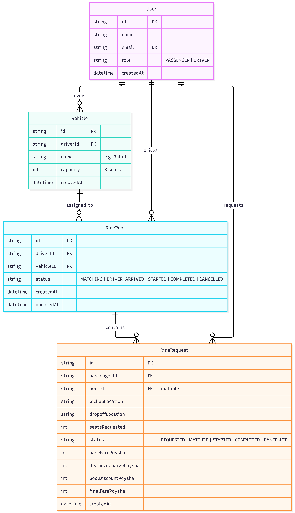

# Tesla - Premium Ride Pooling

**Reducing Dhaka's traffic, one pooled Tesla ride at a time.**

<p align="center">
  
  
  
  
  
  
</p>

<p align="center">
  
  
  
</p>

---

##  Project Overview

**Oi Tesla** (repo: `Dhaka Tesla Pool`) is a localized, full-stack ride-pooling MVP purpose-built for the streets of **Dhaka, Bangladesh**. Instead of dispatching a separate car for every passenger, Oi Tesla intelligently matches multiple passengers who are heading in the same direction — for example, commuters traveling from **Banani to Mohakhali** — into a single high-capacity Tesla Model Y.

By consolidating overlapping trips into shared rides, the platform aims to:

-  **Cut down traffic congestion** on high-density corridors.
- **Lower per-passenger fares** through automatic pool-sharing discounts.
- **Reduce the number of vehicles on the road** for the same number of trips.
-  **Showcase Tesla vehicles** as a premium, sustainable pooling fleet in the local market.

This repository contains the complete MVP: a driver/passenger web client, a real-time trip-matching backend, and the database schema needed to model pooled rides, capacity constraints, and fare splitting.

### 🏗️ System Architecture


---

##  Core Features (MVP)

- **Role-Based UI (Driver vs. Passenger)**
  Separate, purpose-built dashboards — drivers see incoming pool requests and manage vehicle capacity, while passengers request rides and track pooled trip status in real time.

- **Dynamic Fare Calculation**
  Fares are computed on the fly using the formula:

  ```
  Final Fare = Base Fare + (Distance × Rate per KM) − Pool Sharing Discount
  ```

  The Pool Sharing Discount scales with the number of co-passengers in the same vehicle, rewarding riders for pooling.

- **Real-Time Trip State Machine**
  Every ride request flows through a strict, real-time state machine:

  ```
  Requested → Matched → Arrived → Started → Completed
  ```

  State transitions are broadcast live to both driver and passenger clients.

- **Capacity Management**
  The system enforces hard seat-capacity limits per vehicle, preventing overbooking by rejecting or queuing requests that would exceed the remaining available seats.

- **Payment Selection (Cash vs. TeslaPay)**
  Passengers choose their preferred payment method at request time — traditional **Cash** or the platform's integrated **TeslaPay** digital wallet.

---

##  The "Dhaka Scenario" (Test Case)

To validate the pooling and capacity logic end-to-end, the MVP ships with a scripted scenario reflecting a real-world Dhaka commute:

### Setup
- **Driver:** Jashim, driving **"Bullet"** — a **3-seat Tesla Model Y**.
- **Route:** Banani → Mohakhali.

### Happy Path
1. **Nusrat** requests a ride, needing **1 seat**.
2. **Rafiq** requests a ride, needing **1 seat**, along the same route.
3. Jashim accepts both requests into a single `RidePool` on **Bullet**.
4. The fare engine automatically applies a **Pool Discount** to both Nusrat's and Rafiq's fares, since they are now sharing the vehicle.
5. Bullet now has **2 of 3 seats occupied**, with **1 seat remaining**.

### Edge Case — Capacity Enforcement
6. **Shirin** requests a ride needing **2 seats** — but Bullet only has **1 seat left**.
7. The system detects the capacity conflict (`requested seats > available seats`) and **blocks Shirin from joining Jashim's pool**, returning a clear capacity error instead of overbooking the vehicle.

This scenario is used both as a manual QA checklist and as the basis for the automated seed data (see [Local Setup & Installation](#-local-setup--installation)) and integration tests.

---

##  Tech Stack

| Layer          | Technology                                                             |
|----------------|-------------------------------------------------------------------------|
| **Frontend**   | Next.js 14 (App Router), React, TailwindCSS, TypeScript                |
| **Backend**    | Node.js, Express.js, TypeScript, Automated Client Polling (real-time state updates)    |
| **Database**   | PostgreSQL (hosted on [Neon](https://neon.tech))                        |
| **ORM**        | Prisma                                                                  |
| **Auth**       | JWT-based session auth                                                 |
| **Tools**      | ESLint, Prettier, Docker (optional local Postgres), Postman/Insomnia    |

---

##  Docker Deployment (Quick Start)

This project includes a complete Docker Compose configuration that runs both frontend and backend services in isolated containers. No local Node.js or database installation is required.

```bash
# Build and start the containers in detached mode
docker-compose up --build -d
```

- **Frontend App:** `http://localhost:3000`
- **Backend API:** `http://localhost:5000`

To view logs or stop the containers:
```bash
# View live logs
docker-compose logs -f

# Spin down the environment
docker-compose down
```

---

##  Manual Local Setup & Installation

If running outside of Docker, follow these steps to run the services locally.

### 1. Clone the repository

```bash
git clone https://github.com/your-username/dhaka-tesla-pool.git
cd dhaka-tesla-pool
```

### 2. Install dependencies

Install dependencies for both the `frontend` and `backend` workspaces:

```bash
# Backend dependencies
cd backend
npm install

# Frontend dependencies
cd ../frontend
npm install
```

### 3. Configure environment variables

Inside the `backend` directory, create a `.env` file for your Neon PostgreSQL connection string and other secrets:

```bash
cd ../backend
touch .env
```

Add the following to `backend/.env`:

```env
DATABASE_URL="postgresql://<user>:<password>@<your-neon-host>/dhaka_tesla_pool?sslmode=require"
JWT_SECRET="replace-with-a-long-random-secret"
PORT=5000
CLIENT_URL="http://localhost:3000"
```

Inside the `frontend` directory, create a `.env.local` file:

```bash
cd ../frontend
touch .env.local
```

Add the following to `frontend/.env.local`:

```env
NEXT_PUBLIC_API_URL="http://localhost:5000"
```

### 4. Run Prisma migrations

From the `backend` directory, apply the database schema to your Neon Postgres instance:

```bash
cd ../backend
npx prisma migrate dev --name init
```

This will create the `User`, `Vehicle`, `RidePool`, and `RideRequest` tables (see [Database Schema](#-database-schema) below).

### 5. Seed the database

Populate the database with the "Dhaka Scenario" test users — Jashim, Nusrat, Rafiq, and Shirin:

```bash
npx prisma db seed
```

> This runs the seed script defined in `backend/prisma/seed.ts`, creating Jashim's vehicle ("Bullet"), and the four user accounts needed to reproduce the test scenario above.

### 6. Start the development servers

Open two terminal windows/tabs — one for the backend, one for the frontend.

**Terminal 1 — Backend:**

```bash
cd backend
npm run dev
```

The API server will start on `http://localhost:5000`.

**Terminal 2 — Frontend:**

```bash
cd frontend
npm run dev
```

The web client will start on `http://localhost:3000`.

You're all set — open `http://localhost:3000` in your browser to start pooling rides! 

---

##  Database Schema

The data model is defined in `backend/prisma/schema.prisma` and centers around four core models:




- **`User`**
  Represents both drivers and passengers, differentiated by a `role` field (`DRIVER` | `PASSENGER`). Stores profile info, payment preference, and relations to owned vehicles or ride requests.

- **`Vehicle`**
  Represents a driver's Tesla (e.g., "Bullet"). Tracks `model`, `totalSeats`, `availableSeats`, and is linked to a `User` (the driver) and any active `RidePool`.

- **`RidePool`**
  Represents an active, shared trip on a single vehicle. Tracks the assigned `Vehicle`, the current trip `status` (state machine: `REQUESTED → MATCHED → ARRIVED → STARTED → COMPLETED`), route origin/destination, and the collection of `RideRequest`s pooled into it.

- **`RideRequest`**
  Represents an individual passenger's request to join a pool. Stores `seatsRequested`, calculated `fare`, `paymentMethod` (`CASH` | `TESLAPAY`), and a foreign key linking it to the `RidePool` it was matched into (or `null` if unmatched/rejected).

---

##  Viral Scaling Architecture

This MVP is deliberately lean — but it's designed with a clear path to massive scale. For the full system design and infrastructure roadmap covering how Oi Tesla scales from an MVP to **1M passengers and 100K drivers** using **Redis** (real-time matching & caching), **Kafka** (event-driven trip pipelines), and **stateless workers** (horizontally scalable matching/fare engines), check out:

📄 [`docs/ARCHITECTURE_VIRAL_SCALE.md`](docs/ARCHITECTURE_VIRAL_SCALE.md)

---


##  AI Integration & Usage Disclosure

Generative AI (Cursor/Copilot) was utilized during the development of this MVP to accelerate boilerplate generation (Express routing, Next.js UI scaffolding), format Tailwind CSS layouts, and assist in structuring the Docker infrastructure. All core business logic, database schema design, capacity constraint enforcement, and architectural decisions were independently engineered and verified via integration tests.

<p align="center">Made by - Utsho Heaven Chowdhury </p>